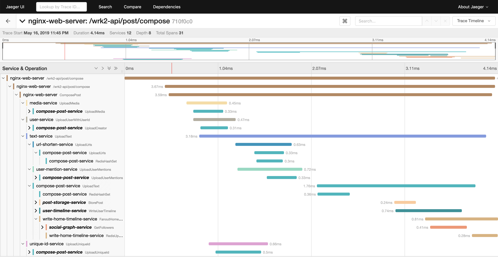

# Social Network Microservice Deployment

A social network with unidirectional follow relationships, implemented with loosely-coupled microservices, communicating with each other via Thrift RPCs.

## Application Structure


## Supported actions:

* Create text post (optional media: image, video, shortened URL, user tag)
* Read post
* Read entire user timeline
* Receive recommendations on which users to follow
* Search database for user or post
* Register/Login using user credentials
* Follow/Unfollow user

## Table of Contents
- [Dependencies](#dependencies)
- [Getting Started](#getting-started)
  - [Before you start](#before-you-start)
  - [Run the Startup Script](#run-the-startup-script)
  - [Construct social graphs](#construct-social-graphs)
  - [Shutting Down the Deployment Safely](#shutting-down-the-deployment-safely)
- [Generating Workloads](#running-http-workload-generator)
  - [Compose posts](#compose-posts)
  - [Read home timeline](#read-home-timelines)
  - [Read user timeline](#read-user-timelines)
- [Viewing traces using Jaeger](#view-jaeger-traces)
- [Use the social network frontend](#use-the-frontend)
- [Frequently Asked Questions](#frequently-asked-questions)
- [Development Status](#development-status)
- [Contact Us](#contact-us)

## Dependencies

* [Docker](https://docs.docker.com/engine/install/)
* [Helm](https://helm.sh/docs/intro/quickstart/)
* [kubectl](https://kubernetes.io/docs/tasks/tools/)
* [Minikube](https://minikube.sigs.k8s.io/docs/start/)
* Python 3.5+ with the packages stated in `requirements.txt` (`pip install -r requirements.txt`)
* screen (`sudo apt-get install screen`)
* libssl-dev (`sudo apt-get install libssl-dev`)
* libz-dev (`sudo apt-get install libz-dev`)
* luarocks (`sudo apt-get install luarocks`)
* luasocket (`sudo luarocks install luasocket`)

## Getting Started

### Before you start

Make sure the following ports are available:
- `2333` for Chaos Mesh
- `8080` for API
- `9090` for Prometheus
- `9200` for Elasticsearch
- `16686` for Jaeger

### Run the Startup Script

> Ensure that the required permissions are set `
chmod +x pod_running_check.sh`

Run the startup command
```bash
bash k8startup.sh <cpus_per_node> <mem_per_node> <nodes_total> <num_instances>
```
> A good starting point: `bash k8startup.sh 4 8000 2 1` *(scale up or down as necessary)*

### Construct social graphs

You need to construct social graphs to replicate real social connections between accounts. Register users and construct social graph by running: 

```bash
python3 scripts/init_social_graph.py --graph=<socfb-Reed98, ego-twitter, or soc-twitter-follows-mun>
```

It will initialize a social graph from a small social network [Reed98 Facebook Networks](http://networkrepository.com/socfb-Reed98.php), a medium social network [Ego Twitter](https://snap.stanford.edu/data/ego-Twitter.html), or a large social network [TWITTER-FOLLOWS-MUN](https://networkrepository.com/soc-twitter-follows-mun.php).

### Shutting Down the Deployment Safely

If you need to shut down the machine that is running the deployment, to avoid data loss and potential issues, the shutdown script should be ran.

```bash
bash k8shutdown.sh
```

This script should gracefully shut down the deployment. When you go to startup the deployment again, you should run the startup script once more.

```bash
bash k8startup.sh 1 1 1 1 # the numbers are placeholders as the cluster already exists
```

The startup script will handle starting all pods again and ensuring ports are forwarded correctly.

## Running HTTP workload generator

> Before starting, you must compile wrk2

```bash
cd ../wrk2
make
cd ../socialNetwork/experiments/workload-generation
```

### Compose posts

```bash
bash ./run_compose_post.sh <threads> <connections> <duration> <requests_per_second>
```

### Read home timelines

```bash
bash ./run_home_timeline.sh <threads> <connections> <duration> <requests_per_second>
```

### Read user timelines

```bash
bash ./run_user_timeline.sh <threads> <connections> <duration> <requests_per_second>
```

***For all of the above, time-series graphs will be stored in the `results` folder in PNG format.***

## View Jaeger traces

You can view Jaeger's frontend using `http://localhost:16686`, or you can download all traces through elasticsearch by running `download_traces.py`.

Example of a Jaeger trace for a compose post request:



## Use the Frontend

After starting the deployment using `k8startup.sh`, visit `http://localhost:8080` to use the frontend.

First you could see the login and signup page:


In order to load default users into database, visit `http://localhost:8080/main.html` once. Then click compose to post new contents.

After composing a few posts, you could see your own posts in user timeline page. Click the follow button on the right side to follow default users:


To see your own posts in home timeline page, click the username and profile button:


Posts could be mixed with text, mentions and images.

Click the contact button to follow/unfollow other users; follower/followee list is shown below in the form of user-id:


## Frequently Asked Questions

### Enable TLS

> This may not work if you are deploying using Minikube

If you are using `docker-compose`, start docker containers by running `docker-compose -f docker-compose-tls.yml up -d` to enable TLS.

Since the `depends_on` option is ignored when deploying a stack in swarm mode with a version 3 Compose file, you
must turn on TLS manually by modifing `config/mongod.conf`, `config/redis.conf`, `config/service-config.json` and
`nginx-web-server/conf/nginx.conf` to enable TLS with `docker swarm`.

### Enable Redis Sharding

> This may not work if you are deploying using Minikube

Start docker containers by running `docker-compose -f docker-compose-sharding.yml up -d` to enable cache and DB sharding. Currently only Redis sharding is available.

### MetricsAPI is not available

> Only repeat this step if you are running `k8scale_auto.sh`!

```bash
kubectl apply -f https://github.com/kubernetes-sigs/metrics-server/releases/latest/download/components.yaml
kubectl patch deploy metrics-server -n kube-system --type='json' -p='[{"op": "add", "path": "/spec/template/spec/containers/0/args/-", "value": "--kubelet-insecure-tls=true"}]'
```

## Development Status

This application is still actively being developed, so keep an eye on the repo to stay up-to-date with recent changes.

### Planned Updates

* Upgraded recommender
* Upgraded search engine
* MongoDB and Memcached sharding

## Contact Us

For any questions please contact us at: <G.Winchester@sussex.ac.uk>